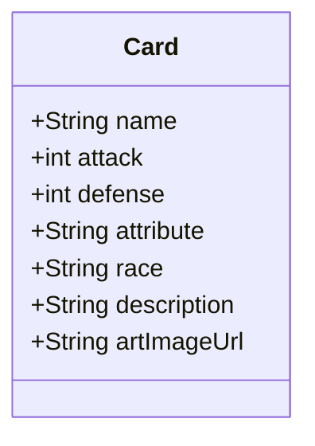

# Desafio final Bootcamp Santander 2023

Java RESTful API criada para o desafio final.
Voltada para armazenar cartas de diversos jogos em um banco de dados na nuvem.

## Diagrama de Classes (Domínio da API)

## Swagger UI

## Banco de dados na nuvem com Railway

